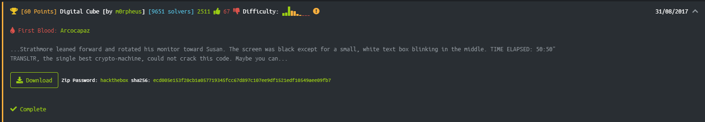
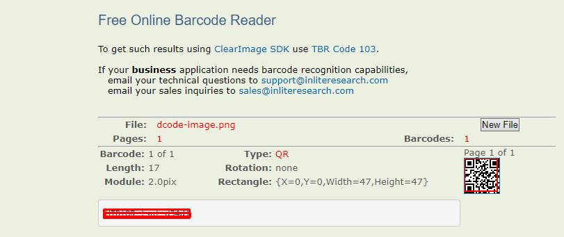

# Digital Cube



We can do this challenge in any operative system.

With Linux, we start off by unziping the zip we got from HTB, using ```unzip digitalcube.zip; rm digitalcube.zip```

We then get a digitalcube.txt

```bash
└─$ cat digitalcube.txt
1111111111111100111111001100110000001111111111111111111111111111001111110011001100000011111111111111110000000000110011111100000000001100110000000000111100000000001100111111000000000011001100000000001111001111110011001100111100110011000011001111110011110011111100110011001111001100110000110011111100111100111111001100111100110000110000001100111111001111001111110011001111001100001100000011001111110011110011111100110000000000001111111100110011111100111100111111001100000000000011111111001100111111001111000000000011001100001111111100000011000000000011110000000000110011000011111111000000110000000000111111111111111100110011001100110011001111111111111111111111111111001100110011001100110011111111111111000000000000000000110000110011110000000000000000000000000000000000001100001100111100000000000000000011110000111111000000001100111100000000110011111111111100001111110000000011001111000000001100111111110000000011000011111111001100001111000000110000001100000000110000111111110011000011110000001100000011000000001100110011000011111111111100111111110000000000000011001100110000111111111111001111111100000011111111000000110000111100110011001111000000111100111111110000001100001111001100110011110000001111001111110000001111000011001111000011111100001111111111111100000011110000110011110000111111000011111111110000001100000011110000001111110011000011001111111100000011000000111100000011111100110000110011111100000000000011001111110000000011000000110000000000000000000000110011111100000000110000001100000000000000001100000000110000001100110011110000000011110000000011000000001100000011001100111100000000111100111111111100111111110011001111001111111111110000001111111111001111111100110011110011111111111100000000000000000000001100000011000011110000001100000011000000000000000011000000110000111100000011000000111111111111111100001100111111110011001100110011000011111111111111000011001111111100110011001100110000110000000000110011000011001100111100000011001100001100000000001100110000110011001111000000110011000011001111110011001111110011110000111111111111000011110011111100110011111100111100001111111111110000111100111111001100000011000011110000111111000000111111001111110011000000110000111100001111110000001111110011111100110000001100000000001100000000110011001100111111001100000011000000000011000000001100110011000000000011001100000011001111000011111100111100110000000000110011000000110011110000111111001111001111111111111100110011110011111100110000001100111111111111111111001100111100111111001100000011001111 
```

Let's try to convert it to ASCII.

```ASCII
ÿüüÌÿÿÿ?3ÿüÏÀÀ3ð0ÏÌÏ3üóó3ÌÃ?<üÏ0ÀÏÏ?3Ì03óÏÌ?Ìüóóó?<Ì?ÀÀ3ð0ÿüÌÌÏÿÿÿ333ÿððÃ<ðü<?ü?ÏÏð?Ì<óÌÃÿÏð30ÿóüð0ó3Àóü<Ìð<üðü?ÿÃ<?üóÿÀüÃ?ü?ÀÀ0Ïð3À<ÿÏó<ÿð?óüÏ?ü<ÿü3üÌÌ?ÿÿ33Ì3<Ã3Ï0ÏÌüðÿðóó?<?ü<üÀÃÃð??00ðüÏÌÀ33ó0ÌÌðüó3<?<ÿüÏ?03ÿÿ3ÏÌ
```

Well, it seems this is a dead end...

Let's try to read again the challenge... I saw some clues, the title itself ```Digital Cube``` and ```TIME ELAPSED: 50:50```, so.. a cube and 50:50, it seems like a ratio, 50x50px.
So using this website https://www.dcode.fr/binary-image to convert binary to text, setting 50 as width I got this image:


We can apreciate that it's a QR and the 0's were black pixels and the 1's were white pixels.

So we'll read it, I will use https://online-barcode-reader.inliteresearch.com.

And finally we got the flag


