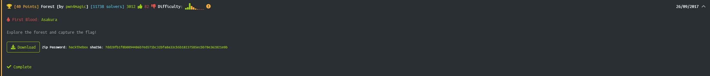

# Forest



Firs of all we have an image of a forest, so applying some stego checks, using an online tool https://stegonline.georgeom.net/upload, I found something interesting, setting a bit plane with Green 0:


So we get the message "IsJuS1Af0r3sTbR0", which looks like a passphrase.

So I'll try to use this passphare with steghide to see if we get any relevant information hidden..

```bash
└─# steghide extract -sf forest.jpg -p IsJuS1Af0r3sTbR0                                                                                     1 ⨯
anot� los datos extra�dos e/"nothinghere.txt".
```

Let's check ```nothinghere.txt```

```bash
└─# cat nothinghere.txt 
Gur sberfg vf n pbzcyrk rpbflfgrz pbafvfgvat znvayl bs gerrf gung ohssre gur rnegu naq fhccbeg n zlevnq bs yvsr sbezf.
Gur gerrf uryc perngr n fcrpvny raivebazrag juvpu, va ghea, nssrpgf gur xvaqf bs navznyf naq cynagf gung pna rkvfg va 
gur sberfg. Gerrf ner na vzcbegnag pbzcbarag bs gur raivebazrag. Gurl pyrna gur nve, pbby vg ba ubg qnlf, pbafreir urng 
ng avtug, naq npg nf rkpryyrag fbhaq nofbeoref. UGO{NzNm1aTfXvyYmMOe0}
```

We can see ```UGO{NzNm1aTfXvyYmMOe0}```` we can figure out that this text is encrypted so analyzing the firsts letters of the encrypted flag ```UGO``` is ```HTB``` so there are 13 more characters in each position in the ASCII table.
So we can deduce that it's the ROT13 encoding (Caesar cypher), using a decrypter online we got the flag.

```
The forest is a complex ecosystem consisting mainly of trees that buffer the earth and support a myriad of life forms. 
The trees help create a special environment which, in turn, affects the kinds of animals and plants that can exist in the forest. 
Trees are an important component of the environment. 
They clean the air, cool it on hot days, conserve heat at night, and act as excellent sound absorbers. HTB{XXXXXXXXXXXXXX}
```
