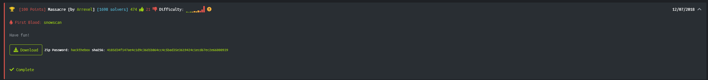

# Massacre



This is the image:


This is one of the two most difficult challenges for stego on this website and with good reason.

For this challenge we will have to use a python script in my case.

After doing a long long research, I realized that some subpixels of each pixel (RGB value) doesn't end with 0, so ...
The script skips the no relevant rgb values:

```python
for rgb in pixels:  # Skipping zero rgb's
        if rgb != (0, 0, 0):
                nozero.append(rgb)
```

Process just the octals which isn't end with 0:

```python
for i in nozero:
        if i[0] % 10 != 0 or i[1] % 10 != 0 or i[2] % 10 != 0:  # Some numbers don't end with 0, so we'll want it
```

Then extract the LSB (least significant bit), generating a new RGB value, convert it to binary and finally gets the ASCII char represents by the binary number converted to decimal:

```python
            r = '{:08b}'.format(i[R] % 10)[6:8] # Get the last 2 bits of the octal obtained by doing module 10, and convert them to binary
            g = '{:08b}'.format(i[G] % 10)[5:8] # Get the last 3 bits ----
            b = '{:08b}'.format(i[B] % 10)[5:8] # Get the last 3 bits ----
            str = r + g + b # All the bits represents a binary number
            i = chr(int(str[:8], 2))  # ASCII char from each 8 bits number converted to decimal
            message = message + i   # Joins each char to a message
```

Then only the flag is searched in the message formed by all the characters:

```python
regex = re.compile("(HTB{.*})") # Creating the pattern to find the flag inside the message
found = regex.search(message)   # Searching that regex in the message
```

Finally it everything was ok, we'll get the flag.

Actually this script takes very little time thanks to the filters that were implemented and optimizations.

Byee
