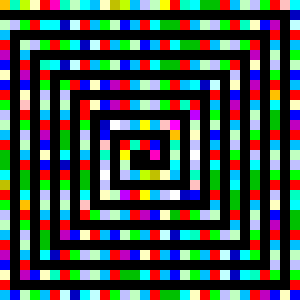

# Not Art




Description:
This has nothing to do with art. Looks the same but is (very) different.

To get started, After extract all the RGB values (pixels), I can see it contains only 3 values, 0, 192 and 255 so that makes me think that it would be express numbers from 0 to 2 (BASE 3), so the thing is to decode each RGB into numbers in Base 3 and then decode it into ASCII chars.

So...

# 1. Extract all RGB

```python
first = 0
last = 29

while first*10+5 < 135: #Just follow the lines of the image each 10 pixels (blocks)
    for i in range(first, last+1):
        processed_rgb.append(pixels[i*10+5,first*10+5])
    for i in range(first+1, last+1):
        processed_rgb.append(pixels[last*10+5,i*10+5])
    for i in reversed(range(first, last)):
        processed_rgb.append(pixels[i*10+5,last*10+5])
    for i in reversed(range(first+2, last)):
        processed_rgb.append(pixels[first*10+5,i*10+5])
    processed_rgb.append(pixels[(first+1)*10+5,(first+2)*10+5])
    first += 2
    last -= 2
processed_rgb.append(pixels[145,145])
processed_rgb.append(pixels[155,145])
processed_rgb.append(pixels[155,155])
```

I wanna say thx to Luthorien for this previous part, it was quite complicated for me

# 2. Substitute 0, 192, 255 to 0, 1, 2
# 3. Concatenate the values to get a 3-digits number (BASE 3)
# 4. Convert the 3 digits number into base 10 number

```python
for i in range(len(processed_rgb)):
    temp = 0
    for j in range(3):  # Conversion to base 3
        if processed_rgb[i][j] == 192:
            temp += 1*(3**(2-j))
        if processed_rgb[i][j] == 255:
            temp += 2*(3**(2-j))
```

# 5. Decode the ASCII char associated to the number

Well the message was like: 

```
UGOYRSGPHEYLOENPXRGHCCREPNFRVH...
```

but UGO is HTB in ROT13 so we have to decode the ROT13 message 

```python
rgb_decoded.append(chr(97+((temp+12)%26))) # ROT+13 decode + ascii decode
```

The result message is like:

```
htbleftcurlybracketuppercaseiunderscorelowercasetuppercaseolowercaseluppercase
```

Well, it seems we have to replace each word by the symbol

# 6. Replacing by symbols

```python
message = message.replace("underscore", "_")
message = message.replace("leftcurlybracket", "{")
message = message.replace("rightcurlybracket", "}")
message = message.replace("exclamationmark", "!")
message = message.replace("lowercase", "")

while message.find("uppercase") != -1:
    array = list(message)
    array[message.find("uppercase") + 9] = array[message.find("uppercase") + 9].upper()
    message = "".join(array)
    message = message.replace("uppercase", "", 1)
```

Byee
