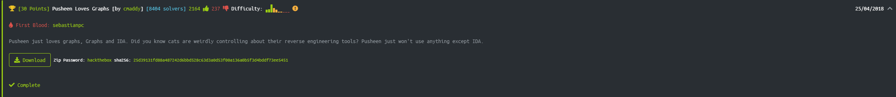
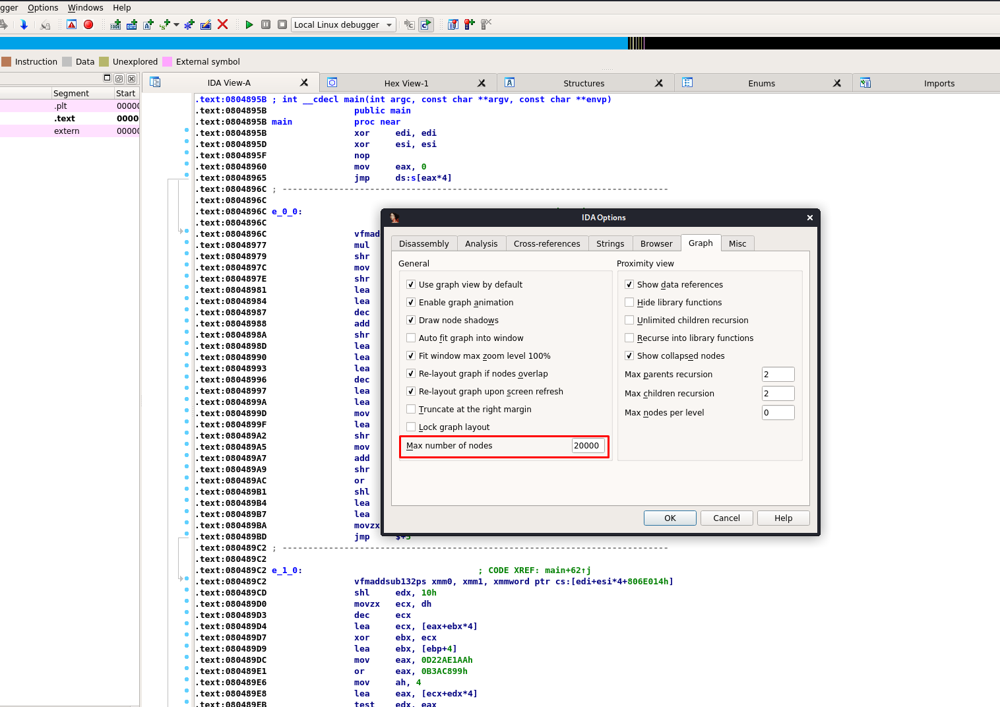
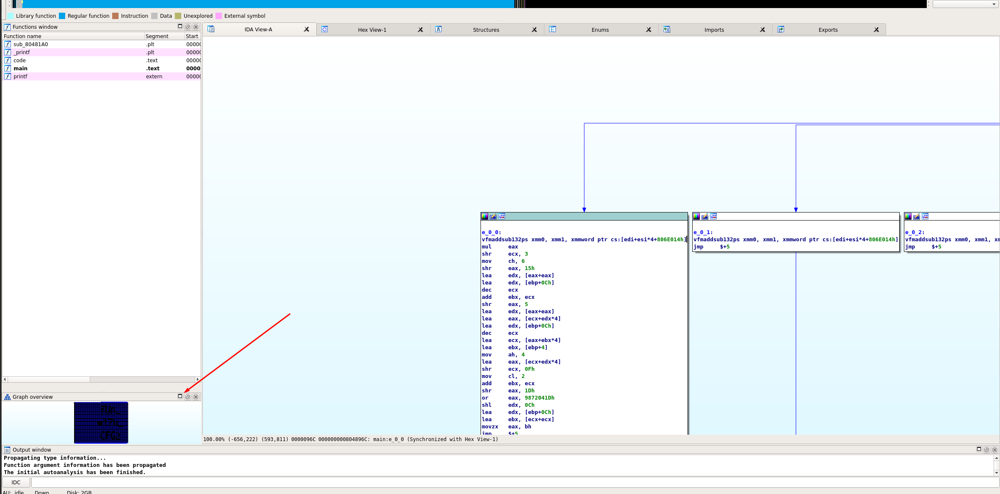

# Pusheen Loves Graphs



Unzipping the package as always we got a file called ```Pusheen```, since it has no extension, with ```file``` we can figure out which type of file it's. 

```bash
└─# file Pusheen                                                                                                                            4 ⨯
Pusheen: ELF 32-bit LSB executable, Intel 80386, version 1 (SYSV), dynamically linked, interpreter /lib/ld-linux.so.2, not stripped
```

Pusheen it's an linux executable.
So let's run the file..

```bash
└─# ./Pusheen 
   ▐▀▄      ▄▀▌   ▄▄▄▄▄▄▄             
   ▌▒▒▀▄▄▄▄▀▒▒▐▄▀▀▒██▒██▒▀▀▄          
  ▐▒▒▒▒▒▒▒▒▒▒▒▒▒▒▒▒▒▒▒▒▒▒▒▒▒▀▄        
  ▌▒▒▒▒▒▒▒▒▒▒▒▒▒▄▒▒▒▒▒▒▒▒▒▒▒▒▒▀▄      
▀█▒▒█▌▒▒█▒▒▐█▒▒▀▒▒▒▒▒▒▒▒▒▒▒▒▒▒▒▒▌     
▀▌▒▒▒▒▒▀▒▀▒▒▒▒▒▀▀▒▒▒▒▒▒▒▒▒▒▒▒▒▒▒▐   ▄▄
▐▒▒▒▒▒▒▒▒▒▒▒▒▒▒▒▒▒▒▒▒▒▒▒▒▒▒▒▒▒▒▒▒▌▄█▒█
▐▒▒▒▒▒▒▒▒▒▒▒▒▒▒▒▒▒▒▒▒▒▒▒▒▒▒▒▒▒▒▒▒▐▒█▀ 
▐▒▒▒▒▒▒▒▒▒▒▒▒▒▒▒▒▒▒▒▒▒▒▒▒▒▒▒▒▒▒▒▒▐▀   
▐▒▒▒▒▒▒▒▒▒▒▒▒▒▒▒▒▒▒▒▒▒▒▒▒▒▒▒▒▒▒▒▒▌    
 ▌▒▒▒▒▒▒▒▒▒▒▒▒▒▒▒▒▒▒▒▒▒▒▒▒▒▒▒▒▒▒▐     
 ▐▒▒▒▒▒▒▒▒▒▒▒▒▒▒▒▒▒▒▒▒▒▒▒▒▒▒▒▒▒▒▌     
  ▌▒▒▒▒▒▒▒▒▒▒▒▒▒▒▒▒▒▒▒▒▒▒▒▒▒▒▒▒▐      
  ▐▄▒▒▒▒▒▒▒▒▒▒▒▒▒▒▒▒▒▒▒▒▒▒▒▒▒▒▄▌      
    ▀▄▄▀▀▀▀▄▄▀▀▀▀▀▀▄▄▀▀▀▀▀▀▄▄▀       
 
                                                   
```

Okey it's a cat haha, thanks to the clues in the description of the challenge, we know that we will have to use IDA.

So when we open the file we got an error about the program cant create/display a graph cuz the file has more than 1000 nodes so we'll change this limit:

Options>IDA Options>Graph>Max number of nodes



20000 nodes it's enough.

Now the graph was created and we can display it



In the graph we found the flag, rather the content.

