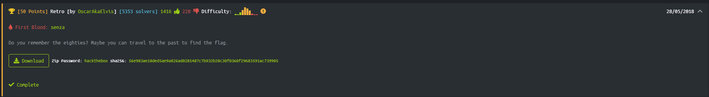

# Retro



First of all, extract the data and check the file's info.

```
└─# file retro.jpg
retro.jpg: JPEG image data, Exif Standard: [TIFF image data, big-endian, direntries=2], baseline, precision 8, 1920x1080, components 3
```
Nothing interesting here.

Now let's try binwalk

```
└─# binwalk retro.jpg

DECIMAL       HEXADECIMAL     DESCRIPTION
--------------------------------------------------------------------------------
28            0x1C            TIFF image data, big-endian, offset of first image directory: 8
233685        0x390D5         Zip archive data, at least v2.0 to extract, compressed size: 76, uncompressed size: 87, name: eighties_were_nice.txt
233813        0x39155         Zip archive data, at least v2.0 to extract, compressed size: 3991, uncompressed size: 549308, name: retro.wav
238038        0x3A1D6         End of Zip archive, footer length: 22
```

We can see there's a zip file inside of retro.jpg which contains 2 files: ```eighties_were_nice.txt``` and ```retro.wav````.

So let's extract them, we can use binwalk again with the option ```-e```

```
└─# binwalk -e retro.jpg    

DECIMAL       HEXADECIMAL     DESCRIPTION
--------------------------------------------------------------------------------
28            0x1C            TIFF image data, big-endian, offset of first image directory: 8
233685        0x390D5         Zip archive data, at least v2.0 to extract, compressed size: 76, uncompressed size: 87, name: eighties_were_nice.txt
233813        0x39155         Zip archive data, at least v2.0 to extract, compressed size: 3991, uncompressed size: 549308, name: retro.wav
238038        0x3A1D6         End of Zip archive, footer length: 22
```

Now unzip...

```bash
└─# unzip eighties_were_nice.zip 
Archive:  eighties_were_nice.zip
  inflating: eighties_were_nice.txt  
  inflating: retro.wav    
```

Another way to extract the data is using ```dd```, we give as if (input file) the file retro.jpg and we generate an output file (of) called eighties_were_nice.zip. With the skip parameter we tell dd not to consider the content of the file up to that decimal address.

```bash
└─# dd if=retro.jpg bs=1 skip=233685 of=eighties_were_nice.zip
4375+0 registros leídos
4375+0 registros escritos
4375 bytes (4,4 kB, 4,3 KiB) copied, 0,0117964 s, 371 kB/s
```

After that we have to extract anyway with ```unzip```

#

Opening the file ```eighties_were_nice.txt```

```bash
└─# cat eighties_were_nice.txt
Retro style is nice! I hope you can find the "flag" as we usually did in the eighties

```

Well this text contains two clues that we will understand later..

And the wav file ```retro.wav ```

After doing some research about those sounds and thinking it could be a tecnology from the past (thinking in the message from ```eighties_were_nice.txt``` more specifically the 80's)
I found this could be a similar sound when loading programs into Atari. so it must be an Atari program converted to wav.
Knowing this I found a program [MakeTZX](http://ramsoft.bbk.org.omegahg.com/maketzx.html) with converts .wav to .tzx.

````bash
└─# ./maketzx retro.wav flag.tzx

-=[ MakeTZX v2.31 ]=- (C) 1998-2001 RAMSOFT, a ZX Spectrum demogroup.

� Checking input file... ok!
� RIFF Wave PCM (WAV), 549264 samples.
� Sampling rate: 44100 Hz (playing time: 00:12.454)

Block  1 => Program: flag       - Header: Length=   17, Pause=908ms.   
Block  2 => ------------------- - Line=32768, Length=   24, Pause=1224ms.
                                                                       
Done!
```

Now, just using strings we already found the flag.

```bash
└─# strings flag.tzx
ZXTape!
Created with Ramsoft MakeTZX
flag
HTB{XXXXXXXXXXXXX}
```

Happy Hacking 
