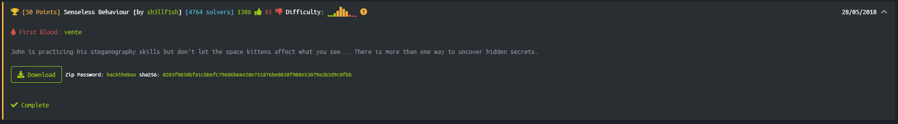
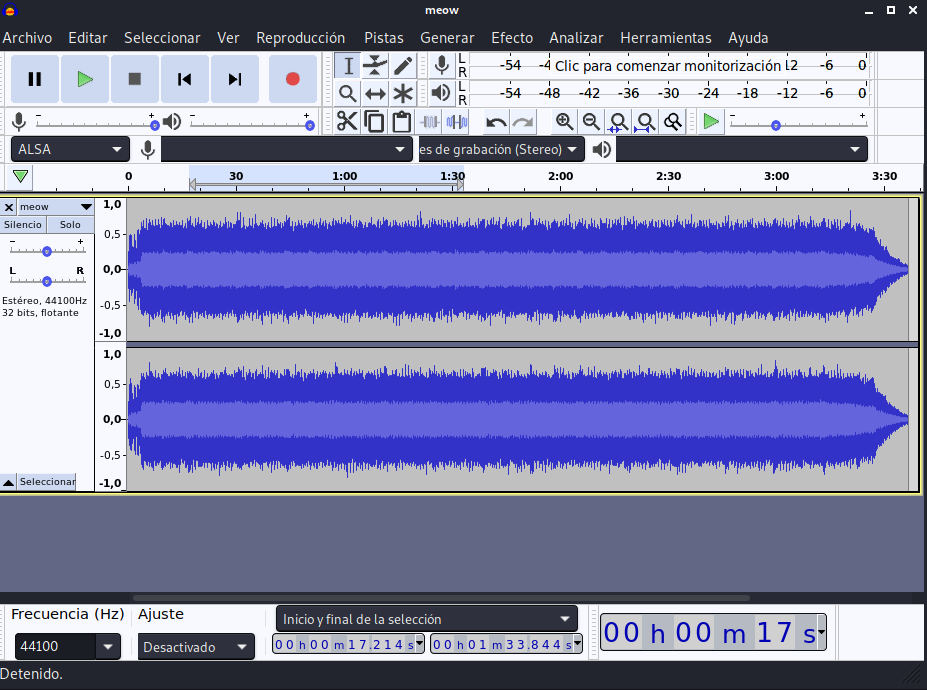

# Senseless Behaviour



```bash
└─# file meow.wav 
meow.wav: RIFF (little-endian) data, WAVE audio, Microsoft PCM, 16 bit, stereo 44100 Hz
```

Nothing here..

```bash
└─# strings meow.wav | awk 'length($0) > 20'
35/*o7Q5p:p7=<,2]<5(d:]
(A$"2P'M<P._@t0Q@B/=A
#"A=)J>O+J6~)o-'$O'L!h!
d+) e-z"(/&$R1V&'4u'k6
'*( :h:66\1T4,&cC9*~?
1*3S7u4(9B5#8x4A3@1H(
>s8aBB9wDf8gC>42@o28;
AP:cBG2I:[:]=[;"<%Aq9$I
#o;;%W@a"YAb V?G"B=R#
1|-.32/752/:60+{4^'p3
4l"[8Q$%:X&39>')4M%2.4#
P^V_L~S29rD`AyR1?JM40D?
.       8&)s36$Q,F)`+#6W27?
0pCD/YCS,8Bi)\BJ'qCF&
"s#~(T!p,        ^*:"   (c$D'# 
C~'C?4&_CN*?ET)oCx"7J
:u1.={. <(*!<H&;<^!,<
6k5w6y8I3]:70S9X..7g.
```

...

```bash
└─# binwalk -e meow.wav

DECIMAL       HEXADECIMAL     DESCRIPTION
--------------------------------------------------------------------------------
12897995      0xC4CECB        MySQL MISAM compressed data file Version 3
20226912      0x134A360       MySQL MISAM index file Version 3
26753717      0x1983AB5       MySQL MISAM compressed data file Version 2
36745260      0x230B02C       MySQL MISAM compressed data file Version 11
```

Nothing here either..

Let's chech the wave file with audacity:



Well, we got nothing relevant here again.

Let's try with some bruteforce trying to get some file from the wav using ```steghide```.
I'll use this [Steghide Brute Force Tool](https://github.com/Va5c0/Steghide-Brute-Force-Tool) cuz we have no password so'll brute force it.

```bash
$ python steg_brute.py -b -d rockyou.txt -f meow.wav 

 [i] Searching...
  0%|                |
  
 [+] Information obtained with password: skittles
 
 wrote extracted data to "youfoundme".
 ```
 
 ```bash
 └─# file youfoundme
youfoundme: ASCII text
 ```
 
 The file ```youfoundme``` contains a long BASE64 ciphertext, so we'll decode the BASE64 ciphertext and the dump it into an hexadecimal string, a finally check a bit from this long string
 
 ```bash
└─#  cat youfoundme | base64 --decode | xxd -r -p | head -3
�PNG
▒
IHDR�!� IDATx����S�w����]��:gww:��$v<0���A�����,�B
                                                  B�c�Af2�1&▒Ll�9���Cϻ����������H���t��>?�����KK��Zo]XZe��U�
                                                                                                            �O�0���ة�Ď����$��Q|�|�BGG��"~r���9�Ϭ0�p���UfgWHL_e2q���E&������K��_dl�2cSK��^&qf��K7YY���OX��       ˟|���#V��r�I��)+7����e��a��o��|�{�?�w�?�+����g��-��}��������������p��?s�����m��A���淙u�n}��_�>�J���/���S���O������7�����o���������Y��UF-��U�<}N=�j�
                                                                   ��>y�Q��V�?����v�)�~���?q���ظ�+7�t�A�zO2j���,�}���,]�U����Z���ŵ� ��=��▒��o�J}���.�}!?��ɟu��i��7��ō�;��O�x�!
                              �n1��     �3kL/|"��u��|"��▒��k,��`zf�ٹ5f�?azf�����.��3�h�������3�����-01����eƧ�2�Xf���LN�01����u&�W�J,˟Ϩ���n;9sM���:�3�H�]������O�<�v|�7\�'�ߔ�7o�ضJ���񩫌O.16��ة+;��v�תɥW����v?������'�������E3ˌ��%:����CC����.D[AlG�w`2x1�[14�0��]�ؽ=8}a�m}xR����▒"�3J(<F�so[
                                                                                                                                          _`�`�q����w���)z�&    GG��
                    N�e`d^��9���9F��
                                    ���>���Btu"�:1�~
                                                    �6
                                                      �[*k
                                                          f�������������ҋ��At��l���������!▒%�5F��I��t�N�I�N�?Mx Axp�Hl���
                                                                                                                         ��,ѡ9�26K82E0twK�މ ��B+f����dn���C�qzz��Fp�Dp��"���=��▒޶|���w'�u�@h�@�(��t�OJ�]���i"�鉜�+|���  �����c��9"�ӄ���k���b�tc���k��28��▒]▒,�N�-�x���ڇ���y\�yE��"K���?�5���b�b���������D�����▒�����>H�oh��MMy-y��)���?HU�>��Q��oT�����_K���ߦ��m�
 ```
 
Well, at this point we know that it is a png file, so let's convert it to PNG.

```bash
cat youfoundme | base64 --decode | xxd -r -p > youfoundme.png 
```


We will do the same tests as at the beginning.

```bash
└─# binwalk youfoundme.png

DECIMAL       HEXADECIMAL     DESCRIPTION
--------------------------------------------------------------------------------
0             0x0             PNG image, 702 x 395, 8-bit/color RGBA, non-interlaced
```

```bash
└─# strings youfoundme.png | awk 'length($0) > 10'
JZ`14Ct8syEth
X.199Ab4Fd0
Mx*N4>Kb>C:
!eY%aZ!eY#nR
EEM+rM5rM5RM-
w7W9J'8HF9H
MN|TNlDFdXA
$GW'EW/GW'C[#A]QF
Nl%Cb-Cj-Cli
OjRCjRCrBM|
#4ROP_K@WKP
x7{KfNnLr|}
n1b[6a3/b_1|
0IS?qc/IS?i
aB)e\%eT)cD.
ga#`a3la;fa#
e+id'cb7kfo
@-3Om>Mu.E5
I2<C2<M24I*b&
0lf!bb!lf>hd.P<
2lf%bd%bdyh
1na=nd-f`9,1
R)2I/RI/2i?
Ln5Ln5L~-B>
'l:6&FHLhHXTl
h$ai"nm%fi&bl$8\
fO*:G>6O.6Gn
3Dh8L$<A42Il<Nt,Nd4F2
bl4J84N42I$<
64H42J82Ahh
chhB^#E^#EV)A\,B\"BZ
O8:L$6Ixd6SG3K 4G8
FS+AU+AS+A#
~G|7K|7K:qL>w
Rl9!l9!2=ed
F+iZ#)j=)j=i
3EIU?Je>JAA
i(Qc/Va/VQ_
}%:y1:Y99J#
\`D]nGYlAYlA[jAU
dE:2U&*M.2E6
2u*rU*ju&zm
?8F 4.(8F04N$:)@px
[_JB]BD^B@Z
,bwu#U8Qi=Tnm
;8C"=F49L49B8>D 
IG/i[7YW/)k
OJ?DR?BR?FR7N
>E;!M7!uo       |c
H[U$Lr265Sn
'<J$8L">E*9
```

Nothing relevant till now...

Using Stegsolve, we can use the [online tool](https://www.dcode.fr/braille-alphabet)
