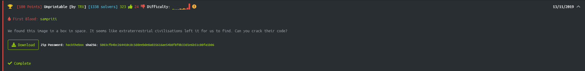
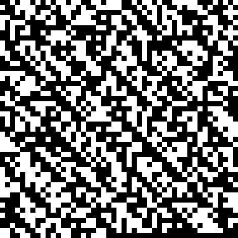
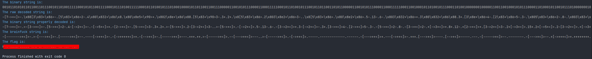

# Unprintable 



Image:



Description:

We found this image in a box in space. It seems like extraterrestrial civilisations left it for us to find. Can you crack their
code?

This is one of the two most difficult challenges for stego on this website and with good reason.

Let's start

# 1. Converting the image into a binary string

We can see that the image is formed by black and white squares so at the beginning I tought each pixel would represent each square but it seems each square is 10 pixels.
So I was processing it every 10.

```python
def generate_binary_string():
    try:
        img = Image.open("Unprintable.png") # Open the img
    except:
        print('Put Unprintable.png file on this directory')
        exit(1)

    pixels = img.convert('RGB') #Convert it in RGB

    width, height = img.size    #Getting the img's dimension

    binary_string = ""
    
    #Loop every 10 pixels
    for y in range(0, height, 10):
        for x in range(0, width, 10):

            r, g, b = pixels.getpixel((x, y))
            
            if r == g == b == 0:    #If the pixel is 0 = black = 0
                binary_string += "0"
            elif r == g == b == 255:    #If the pixel is 255 = white = 1
                binary_string += "1"

    return binary_string
```

**The output would be:**

```
00101101010110110011011100101101001111100010101100111100010111010011111000101101001011101000100001011...
```

# 2. Decode the binary string (Conversion into ASCII)

We'll need first of all convert the binary string in bytes (each 8 bits what will represents a ASCII char)

```python
def bitstring_to_bytes(s):
    v = int(s, 2)
    b = bytearray()
    while v:
        b.append(v & 0xff)
        v >>= 8
    return bytes(b[::-1])
```

And then just decode each byte..

Doing that I found problems to decode certain bytes...
I'll show you the raw output from convert each byte into a ASCII char:

**The raw output:**

```
-[7->+<]>-.\x88[3\x83+\x86>-.[5\x83+\x86>2-.4\x80\x832+\x86\x8.\x80\x8e5+\x90>+.\x802\x8e+\x86\x88.[5\x83+\x90>3-.3+.2+..
```

The problem is that ```\x88``` or ```\x86```, so searching in internet, this [post](https://buer.haus/2018/04/24/montecrypto-argss-write-up/#h.676eiyh9vkrr) gaves me the solution.
It's RLE enconded brainfuck and the bytes in between are compression, so to decompress we have to take the byte, ```\x88``` and get the 8º char of the string with the next char to replace it so the result would be
```>-```.

There's another case, another byte we don't want is ```+1```, so if ```\x9e``` would decode to ```\x88``` and ```\x88 +1``` it only decodes to ```\x88``` wich would be again ```>-```.

To resolve them, you take the byte at ```string[index]``` and ```string[index+1]```, then replace the unprintable byte with those two characters.

The func:

```python
def get_replace(binary_values,bs,next=False):
    index = int.from_bytes(bs, "little") - 128
    if(next):
        _bs = bitstring_to_bytes(binary_values[index + 1])
    else:
        _bs = bitstring_to_bytes(binary_values[index])
    return _bs
    
def decode_binary(binary_string):

    binary_values = [binary_string[i:i+8] for i in range(0, len(binary_string), 8)]

    decoded_str = ""
    raw_str=""
    for i in range(len(binary_values)):
        bs = bitstring_to_bytes(binary_values[i])
        raw_str += str(bs).replace("b'","").replace("'","")
        try:
            decoded_str += bs.decode()
        except:
            _bs = get_replace(binary_values,bs)
            try:
                decoded_str += _bs.decode()
            except:
                __bs = get_replace(binary_values, _bs)
                decoded_str += __bs.decode()
                __bs = get_replace(binary_values, _bs, True)
                decoded_str += __bs.decode()
                continue
            _bs = get_replace(binary_values, bs, True)
            try:
                decoded_str += _bs.decode()
            except:
                __bs = get_replace(binary_values, _bs)
                decoded_str += __bs.decode()
                __bs = get_replace(binary_values, _bs, True)
                decoded_str += __bs.decode()
    print("\033[94m" + "The raw decoded string is:\n" + '\033[1;37;0m' + raw_str )
    return decoded_str
```


**So the correct output is like:**

```
-[7->+<]>-.>-[3->+<]>-.[5->+<]>2-.4-[->2+<]>-.-[->5+<]>+.-[2->+<]>-.[5->+<]>3-.3+.2+.>-[5->+<]>.2-[3->2+<]>3...
```


# 3. RLE Decode (Run Length Encoding Decode)

The decoding process it's basicly find numbers which will indicate the number of repetitions of the next character.

An example is : ```7-``` would be decoded as ```-------```

So..

```python
def rle_decode(decoded_str):
    final_decoded_string = ""
    i = 0
    while i < len(decoded_str):
        if decoded_str[i].isdigit():
            if decoded_str[i + 1].isdigit():
                final_decoded_string += int(decoded_str[i] + decoded_str[i + 1]) * decoded_str[i + 2]
                i += 3
            else:
                final_decoded_string += int(decoded_str[i]) * decoded_str[i + 1]
                i += 2
        else:
            final_decoded_string += decoded_str[i]
            i += 1
    return final_decoded_string
```

# 4. Unbrainfuck this

I just used the brainfuck module

**Instalation:**

```
pip install brainfuck-interpreter
```

**Execution:**

```python
brainfuck.evaluate(final_decoded_string)
```

So the output of the script is:



Byee
